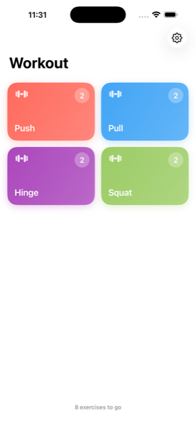
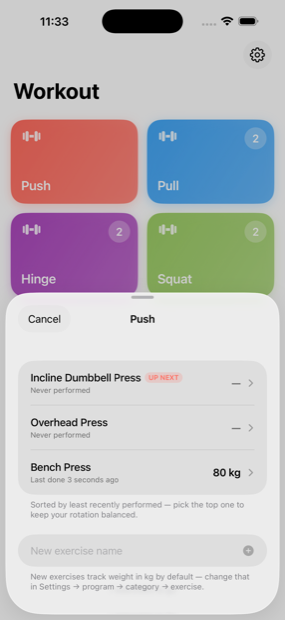
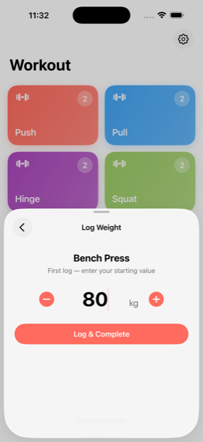
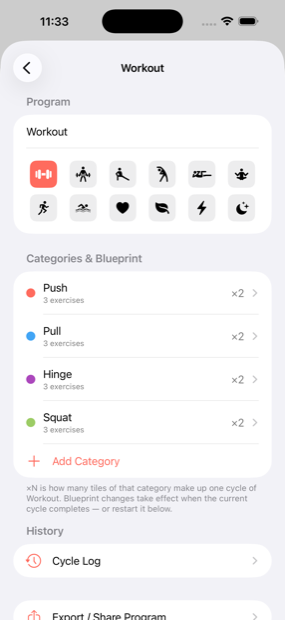
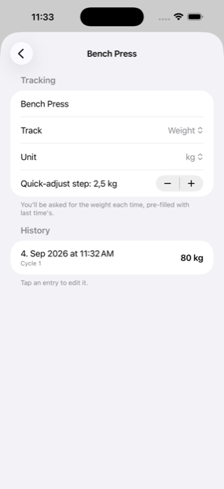

# Rota

A personal iOS tracker built around **cycles instead of calendars**.

Most habit and training apps assume a weekly schedule — chest on Monday, legs on Wednesday. That never survived contact with my actual week. Rota instead tracks *what the current cycle still owes you*, in any order, on any day, and rotates which item fills each slot so you don't fall back on the same one every time.

I use it for my gym sessions and my evening stretching routine. Nothing in it is specific to exercise, though: the same mechanism fits "5 vegetables and 3 protein sources per cycle, with variety" as naturally as it fits push and pull.

Built with [Claude Code](https://claude.com/claude-code).

<p align="center">
  
  
  
</p>

<p align="center">
  <em>The cycle, the rotation, the log. Bench Press has just been logged at 80&nbsp;kg — note that it dropped to the bottom of the stack and Incline Dumbbell Press is now <code>UP NEXT</code>.</em>
</p>

## The two ideas

**A cycle is a quota, not a schedule.** You define what one cycle contains — say 2× Push, 2× Pull, 2× Hinge, 2× Squat. The main view shows what's left. Fill a Push slot and the Push counter drops to 1. When the last slot is filled, the cycle completes and a fresh one begins. Miss three days and nothing breaks; the cycle simply waits.

**Least-recently-used rotation keeps it varied.** The specific items are decoupled from the quota. Tapping "Push" lists every push exercise you've defined, sorted by how long it's been since you last did it — oldest first, top one badged `UP NEXT`. Pick it, log it, and it drops to the bottom of the stack. You end up rotating through variations instead of defaulting to bench press every single session.

**Programs keep unrelated cycles apart.** Workout and Stretching are independent systems, each with its own categories, quota, rotation and history. Finishing a stretch never fills a workout slot — I want balance *within* a domain, not across them. A third program for meals or chores would work the same way.

## Features

- **Counting tiles** — a category needed 12× per cycle is one tile with a `12` badge that counts down, not twelve identical tiles.
- **Search** — find any item across all programs and see which tile it lives behind, how many of that tile are left, or that it's already done this cycle. Tapping a result opens its tile with the item highlighted, so you can log it without hunting.
- **Per-item tracking** — each item records whatever actually makes sense for it: weight (kg/lb), time (s/min), reps, distance (m/km/mi), or **nothing at all**. Untracked items log in a single tap, which is what I wanted for stretches. Units and the ± quick-adjust step are configurable per item.
- **Progressive overload** — the previous value sits beside each item in the picker, and the logging screen pre-fills it so you only adjust the delta.
- **Full history** — every log is kept: per-item history with a progress chart, plus a per-program cycle log showing each cycle's contents and how long it took.
- **Editable log** — fix a value, a timestamp, a cycle number, or delete a cycle outright. Edits re-sync the item's rotation position so the LRU order stays honest.
- **Share a program** — export a program's setup as JSON (clipboard or share sheet) and import one someone sent you. Deliberately carries the blueprint only: categories, items and tracking config, never your history or current progress.
- Everything persists locally. No account, no network, no analytics, no data leaving the phone.

<p align="center">
  
  
</p>

<p align="center">
  <em>A program's blueprint, and what an individual item records.</em>
</p>

## Tech

SwiftUI + SwiftData, iOS 17+, no third-party dependencies.

```
GymApp/
├── Models/
│   ├── Program.swift          # top-level: an independent cycle system
│   ├── Models.swift           # Category, Exercise, CycleTask, TrackingMode
│   ├── LogModels.swift        # CycleRecord, WorkoutLogEntry
│   ├── CycleEngine.swift      # cycle + LRU logic, all program-scoped
│   ├── ProgramBlueprint.swift # JSON export/import
│   └── SeedData.swift         # first-launch data + schema migrations
└── Views/                     # tile grid, picker, logging, settings, logs
```

`CycleEngine` holds the interesting logic and is deliberately free of view code. Log entries snapshot the item's name, category and unit at write time, so renaming or deleting something never corrupts past history.

The Xcode target and source folder are still called `GymApp`: the app was renamed once I noticed the idea generalised beyond the gym, and keeping the bundle identifier means the copy on my phone kept every workout I'd already logged. Renaming it would have made iOS treat it as a different app and start from an empty database.

## Running it

1. Open `GymApp.xcodeproj` in Xcode 16+.
2. Pick a simulator and hit **⌘R**.

For a physical iPhone, set your team under *Signing & Capabilities* first. With a free Apple ID the build expires after 7 days — re-running from Xcode restores it without touching your data.

## Notes

This is software I wrote for myself, published in case the cycle/LRU idea is useful to someone. It fits how I train, which may not be how you train.

There are no automated tests — it was verified by hand in the simulator. The data layer is the part that would most deserve them, since schema migrations run against a database with real history in it.

[`docs/original-spec.md`](docs/original-spec.md) is the brief I started from, kept as a record of the original concept.

## License

MIT — see [LICENSE](LICENSE).
